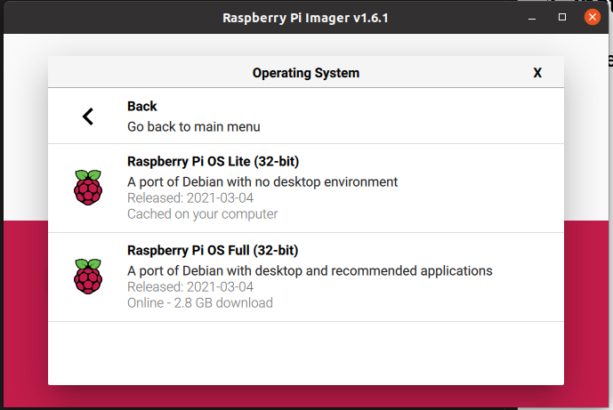

# ADS-B_AI_Project

Aim is to collect flight data (Using RTL-SDR USB device) and create information with AI based algorithms.

## 1. Install raspberry PI with RTL-SDR USB device

### 1.1 Create SD card for Raspberry PI

* Use Raspberry Imager to create a SD card
  Select "**Raspberry PI OS Lite (32-bit)**" operating system.

* Follow instruction [How to Enable SSH on Raspberry Pi](https://linuxize.com/post/how-to-enable-ssh-on-raspberry-pi) --> Chapter Enabling SSH on Raspberry Pi Without a Screen

### 1.2 Start Raspberry PI and login

* Put SD into Raspberry PI
* Login to the Raspberry PI
  ssh pi@ip_address
  raspberry   <-- This is default PW

### 1.3 Install Git

* Follow instruction [How to Install Git on Raspberry Pi](https://linuxize.com/post/how-to-install-git-on-raspberry-pi/)

### 1.4 Install Docker

* Follow instruction [How To Install Docker and Docker-Compose On Raspberry Pi](https://dev.to/elalemanyo/how-to-install-docker-and-docker-compose-on-raspberry-pi-1mo)

### 1.5 Install APP for RTL-SDR USB device

* git clone https://github.com/jussihyva/ADS-B_AI_Project.git

### 1.6 Set environment variables

* cd ADS-B_AI_Project
* touch .env
* Add these param values into the file (Ask values from the administrator)
* INFLUXDBURL2 is optional. It's use for sending data to the second InfluxDB.

#### 1.6.1 Example with connetcion to 1 influxdb

    DEVICE="/dev/bus/usb/001/004"
    SITE_NAME="Koivuhovi"
    TZ="Europe/Helsinki"
    READSB_LAT="60.555555"
    READSB_LON="24.555555"
    INFLUXDBURL="https://10.10.10.10:8086"
    INFLUXDBUSERNAME="kauttajanimi"
    INFLUXDBPASSWORD="salasana"
    INFLUXDBURL2=
    INFLUXDBUSERNAME2=
    INFLUXDBPASSWORD2=

#### 1.6.2 Example with connetcion to 2 influxdb's

    DEVICE="/dev/bus/usb/001/004"
    SITE_NAME="Koivuhovi"
    TZ="Europe/Helsinki"
    READSB_LAT="60.555555"
    READSB_LON="24.555555"
    INFLUXDBURL="https://10.10.10.10:8086"
    INFLUXDBUSERNAME="kauttajanimi"
    INFLUXDBPASSWORD="salasana"
    INFLUXDBURL2="https://another_influxdb_IP:8086"
    INFLUXDBUSERNAME2="kauttajanimi_another_one"
    INFLUXDBPASSWORD2="salasana_not_easy_one"

### 1.7 Start ADS-B

* docker-compose up -d

### 1.8 References

* RTL-SDR start instruction is based on [mikenye/readsb-protobuf](https://github.com/mikenye/docker-readsb-protobuf). Refer to that page for more information
